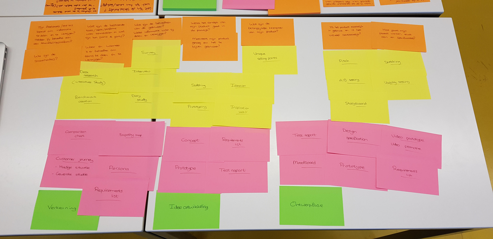

# Design challenge en onderzoeksvragen

## 22.01.2019

### Design challenge

Hoe kan een online interactief platform of applicatie samenwerken tussen werknemers zo efficiënt mogelijk maken, zodat kennis en tijd niet verloren gaat?

## 13.02.2019

Vandaag had ik de workshop Planning. Tijdens deze workshop heb ik met post-its mijn ontwerpfases, onderzoeksvragen, onderzoeksmethoden en deliverables aangegeven.

### Design challenge

Hoe kan een online interactief platform of applicatie samenwerken tussen medewerkers van Woedend! Creative Agency onderling en met freelancers/derden zo efficiënt mogelijk maken, zodat kennis en tijd niet verloren gaat?

### Onderzoeksvragen

**Wat zijn de behoeften van de gebruiker?**  
- Wie zijn de stakeholders?  
****- Hoe ervaren de medewerkers van Woedend! Creative Agency het probleem op dit moment?  
- Wat is het doel en wat zijn de gevolgen van kennisdelen tussen medewerkers en freelancers/derden?  
- Wat zijn de oorzaken van medewerkers die hun kennis niet\(willen\)delen?  
- Wat willen medewerkers van Woedend! Creative Agency delen?  
- Op welk moment willen medewerkers van Woedend! Creative Agency kennis delen?  
- Waar bevinden medewerkers van Woedend! Creative Agency zich op het moment dat zij kennis willen delen?  
- Met wie willen medewerkers van Woedend! Creative Agency kennis delen binnen het bedrijf?  
- Hebben medewerkers van Woedend! Creative Agency behoefte aan het delen en verkrijgen van kennis en informatie met freelancers en derden?  
  
**Zijn freelancers/derden bereid om informatie en kennis te delen en te verkrijgen?**  
- Wat willen freelancers/derden delen?  
- Op welk moment willen freelancers/derden kennis delen met het bedrijf?  
- Waar bevinden freelancers/derden zich op het moment dat zij kennis willen delen?  
- Met wie willen freelancers/derden kennis delen?  
  
**Wat zijn de bestaande tools/apps/platforms voor kennisdelen en wat zijn hun pains & gains?**  
  
**Hoe motiveer je werknemers om het platform blijven te gebruiken?**  
- Welke trends op technisch en visueel gebied zijn er?  
- Welke design patterns zijn geschikt voor het prototype?  
  
**Hoe kunnen verschillende ideeën naar één concreet concept worden ontwikkeld?**  
  
**Wat zijn de belangrijkste kenmerken van het prototype?  
  
Wat vinden de stakeholders van het eerste prototype, als de focus op de functionaliteit en navigatie ligt?**  
  
**Wat vinden de stakeholders van het tweede prototype, als de focus op de structuur ligt?**  
  
**Wat vinden de stakeholders van het derde prototype, als de focus op de details en visuals ligt?**  
  
**Voldoet het prototype aan de eisen van de stakeholders?**

## 27.02.2019

### Design challenge

Hoe kan een online interactieve desktop en mobiele applicatie helpen bij het vastleggen van kennis, informatie en ervaringen tussen medewerkers van Woedend! Creative Agency onderling en met freelancers/derden, zodat kennis niet verloren gaat en processen worden versneld, zonder privacygevoelige en auteursrechtelijke informatie voor iedereen toegankelijk te maken?  

### Onderzoeksvragen

**Wat zijn de behoeften van de gebruiker?**  
- Wie zijn de stakeholders?  
- Hoe ervaren de medewerkers van Woedend! Creative Agency het probleem op dit moment?  
- Wat is het doel en wat zijn de gevolgen van kennisdelen tussen medewerkers en freelancers/derden?  
- Wat zijn de oorzaken van medewerkers die hun kennis niet \(willen\) delen?  
- Wat willen medewerkers van Woedend! Creative Agency delen?  
- Op welk moment willen medewerkers van Woedend! Creative Agency kennis delen?  
- Waar bevinden medewerkers van Woedend! Creative Agency zich op het moment dat zij kennis willen delen?  
- Met wie willen medewerkers van Woedend! Creative Agency kennis delen binnen het bedrijf?  
- Hebben medewerkers van Woedend! Creative Agency behoefte aan het delen en verkrijgen van kennis en informatie met freelancers en derden?

**Zijn freelancers/derden bereid om informatie en kennis te delen en te verkrijgen?**  
- Wat willen freelancers/derden delen?  
- Op welk moment willen freelancers/derden kennis delen met het bedrijf?  
- Waar bevinden freelancers/derden zich op het moment dat zij kennis willen delen?  
- Met wie willen freelancers/derden kennis delen?

**Wat zijn de bestaande tools/apps/platforms voor kennisdelen en wat zijn hun pains & gains?**

**Hoe motiveer je werknemers om het platform blijven te gebruiken?**  
- Welke trends op technisch en visueel gebied zijn er?  
- Welke design patterns zijn geschikt voor het prototype?

**Hoe kunnen verschillende ideeën naar één concreet concept worden ontwikkeld?**

**Wat zijn de belangrijkste kenmerken van het prototype?**

**Wat vinden de stakeholders van het eerste prototype, als de focus op de functionaliteit en navigatie ligt?**

**Wat vinden de stakeholders van het tweede prototype, als de focus op de structuur ligt?**

**Wat vinden de stakeholders van het derde prototype, als de focus op de details en visuals ligt?**

**Voldoet het prototype aan de eisen van de stakeholders?**

## **05.03.2019**

### Design challenge

Hoe kan een online interactieve desktop en mobiele applicatie het vastleggen van kennis, informatie en ervaringen tussen medewerkers van Woedend! Creative Agency onderling en met freelancers/derden motiveren, zodat kennis niet verloren gaat en processen worden versneld, zonder privacygevoelige en auteursrechtelijke informatie voor iedereen toegankelijk te maken?  

### Onderzoeksvragen

**Wat zijn de behoeften van de gebruiker?**  
- Wie zijn de stakeholders?  
- Hoe ervaren de medewerkers van Woedend! Creative Agency het probleem op dit moment?  
- Wat is het doel en wat zijn de gevolgen van kennisdelen tussen medewerkers en freelancers/derden?  
- Wat zijn de oorzaken van medewerkers die hun kennis niet \(willen\) delen?  
- Wat willen medewerkers van Woedend! Creative Agency delen?  
- Op welk moment willen medewerkers van Woedend! Creative Agency kennis delen?  
- Waar bevinden medewerkers van Woedend! Creative Agency zich op het moment dat zij kennis willen delen?  
- Met wie willen medewerkers van Woedend! Creative Agency kennis delen binnen het bedrijf?  
- Hebben medewerkers van Woedend! Creative Agency behoefte aan het delen en verkrijgen van kennis en informatie met freelancers en derden?

**Zijn freelancers/derden bereid om informatie en kennis te delen en te verkrijgen?**  
- Wat willen freelancers/derden delen?  
- Op welk moment willen freelancers/derden kennis delen met het bedrijf?  
- Waar bevinden freelancers/derden zich op het moment dat zij kennis willen delen?  
- Met wie willen freelancers/derden kennis delen?

**Wat zijn de bestaande tools/apps/platforms voor kennisdelen en wat zijn hun pains & gains?**

**Hoe motiveer je werknemers om het platform blijven te gebruiken?**  
- Welke trends op technisch en visueel gebied zijn er?  
- Welke design patterns zijn geschikt voor het prototype?

**Hoe kunnen verschillende ideeën naar één concreet concept worden ontwikkeld?**

**Wat zijn de belangrijkste kenmerken van het prototype?**

**Wat vinden de stakeholders van het eerste prototype, als de focus op de functionaliteit en navigatie ligt?**

**Wat vinden de stakeholders van het tweede prototype, als de focus op de structuur ligt?**

**Wat vinden de stakeholders van het derde prototype, als de focus op de details en visuals ligt?**

**Voldoet het prototype aan de eisen van de stakeholders?**

## **21.03.2019**

### Design challenge

Hoe kan een online interactieve desktop en mobiele applicatie het vastleggen van kennis, informatie en ervaringen tussen medewerkers van Woedend! Creative Agency onderling motiveren, zodat kennis niet verloren gaat en processen worden versneld?  

### Onderzoeksvragen

**Wat zijn de behoeften van de gebruiker?**  
- Wie zijn de stakeholders?  
- Hoe ervaren de medewerkers van Woedend! Creative Agency het probleem op dit moment?  
- Wat is het doel en wat zijn de gevolgen van kennisdelen tussen medewerkers en freelancers/derden?  
- Wat zijn de oorzaken van medewerkers die hun kennis niet \(willen\) delen?  
- Wat willen medewerkers van Woedend! Creative Agency delen?  
- Op welk moment willen medewerkers van Woedend! Creative Agency kennis delen?  
- Waar bevinden medewerkers van Woedend! Creative Agency zich op het moment dat zij kennis willen delen?  
- Met wie willen medewerkers van Woedend! Creative Agency kennis delen binnen het bedrijf?  
- Hebben medewerkers van Woedend! Creative Agency behoefte aan het delen en verkrijgen van kennis en informatie met freelancers en derden?

**Zijn freelancers/derden bereid om informatie en kennis te delen en te verkrijgen?**  
- Wat willen freelancers/derden delen?  
- Op welk moment willen freelancers/derden kennis delen met het bedrijf?  
- Waar bevinden freelancers/derden zich op het moment dat zij kennis willen delen?  
- Met wie willen freelancers/derden kennis delen?

**Wat zijn de bestaande tools/apps/platforms voor kennisdelen en wat zijn hun pains & gains?**

**Hoe motiveer je werknemers om het platform blijven te gebruiken?**  
- Welke trends op technisch en visueel gebied zijn er?  
- Welke design patterns zijn geschikt voor het prototype?

**Hoe kunnen verschillende ideeën naar één concreet concept worden ontwikkeld?**

**Wat zijn de belangrijkste kenmerken van het prototype?**

**Wat vinden de stakeholders van het eerste prototype, als de focus op de functionaliteit en navigatie ligt?**

**Wat vinden de stakeholders van het tweede prototype, als de focus op de structuur ligt?**

**Wat vinden de stakeholders van het derde prototype, als de focus op de details en visuals ligt?**

**Voldoet het prototype aan de eisen van de stakeholders?**

## 07.05.2019 - Definitieve versie

### Design challenge

> Hoe kan een online interactieve desktop en mobiele applicatie medewerkers van Woedend! Creative Agency helpen bij het vastleggen van \(ervaringen met\) tools, freelancers en productie die tijdens projecten zijn ingezet, zodat kennis niet verloren gaat en processen worden versneld?

### Onderzoeksvragen

**Wat zijn de behoeften van de gebruiker?**  
- Wie zijn de stakeholders?  
- Hoe ervaren de medewerkers van Woedend! Creative Agency het probleem op dit moment?  
- Wat is het doel en wat zijn de gevolgen van kennisdelen tussen medewerkers en freelancers/derden?  
- Wat zijn de oorzaken van medewerkers die hun kennis niet \(willen\) delen?  
- Wat willen medewerkers van Woedend! Creative Agency delen?  
- Op welk moment willen medewerkers van Woedend! Creative Agency kennis delen?  
- Waar bevinden medewerkers van Woedend! Creative Agency zich op het moment dat zij kennis willen delen?  
- Met wie willen medewerkers van Woedend! Creative Agency kennis delen binnen het bedrijf?  
- Hebben medewerkers van Woedend! Creative Agency behoefte aan het delen en verkrijgen van kennis en informatie met freelancers en derden?

**Zijn freelancers/derden bereid om informatie en kennis te delen en te verkrijgen?**  
- Wat willen freelancers/derden delen?  
- Op welk moment willen freelancers/derden kennis delen met het bedrijf?  
- Waar bevinden freelancers/derden zich op het moment dat zij kennis willen delen?  
- Met wie willen freelancers/derden kennis delen?

**Wat zijn de bestaande tools/apps/platforms voor kennisdelen en wat zijn hun pains & gains?**

**Hoe motiveer je werknemers om het platform blijven te gebruiken?**  
- Welke trends op technisch en visueel gebied zijn er?  
- Welke design patterns zijn geschikt voor het prototype?

**Hoe kunnen verschillende ideeën naar één concreet concept worden ontwikkeld?**

**Wat zijn de belangrijkste kenmerken van het prototype?**

**Wat vinden de stakeholders van het eerste prototype, als de focus op de functionaliteit en navigatie ligt?**

**Wat vinden de stakeholders van het tweede prototype, als de focus op de structuur ligt?**

**Wat vinden de stakeholders van het derde prototype, als de focus op de details en visuals ligt?**

**Voldoet het prototype aan de eisen van de stakeholders?**

