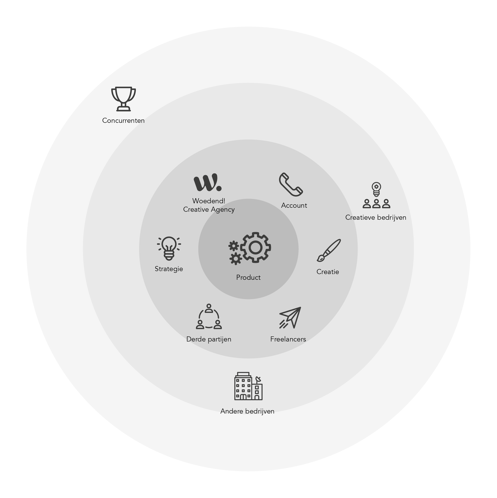
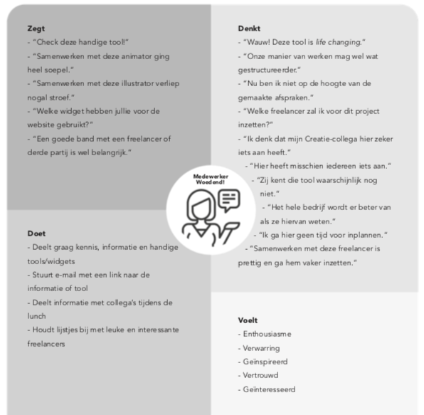
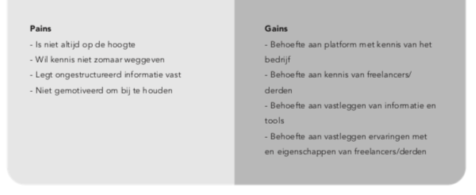
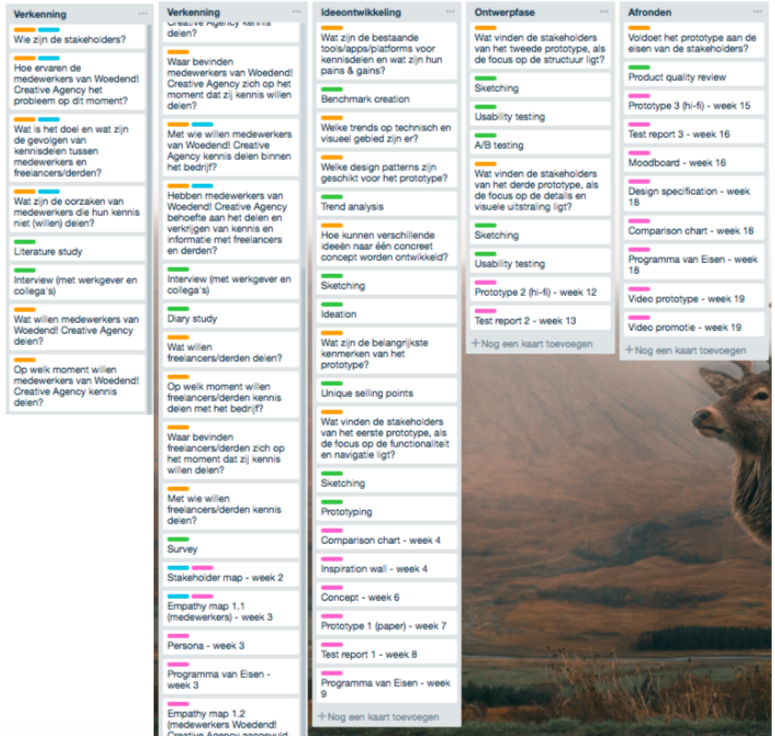

# 25.02.2019

**Download hier het opgemaakte document**



## Inleiding

“Knowledge is power”, een veelgehoorde uitspraak van filosoof Francis Bacon,oftewel kennis is een van de belangrijkste dingen in het leven. Je neemt het je hele leven mee. Echter wordt kennis pas nuttig als je er iets mee doet.  
Tegenwoordig worden steeds meer derde partijen en freelancers ingezet in bedrijven. Freelancers zijn werknemers zonder een vast contract. Nederland telde vorig jaar maar liefst 1,1 miljoen freelancers. Het merendeel hiervan is werkzaam inde creatieve sector. Doordat deze flexibele werkers meestal tijdelijk bij een bedrijfwerken, gaat hun kennis verloren in het bedrijf wanneer zij vertrekken.  
Ook tussen vaste medewerkers speelt dit probleem. Informatie wordt niet overgebracht of niet op het goede moment. De informatie die tussen een medewerker en freelancer of derde partij wordt gedeeld, wordt vaak ook niet gedeeld tussen de medewerkers onderling. Er wordt langs elkaar heen gewerkt wat leidt tot dubbel werk en het verliezen van tijd.

Ik werk sinds 6 maanden bij Woedend! Creative Agency en hetzelfde probleem doet zich hier voor. Externe tools die freelancers en derden inzetten, worden niet vastgelegd en handige trucjes die medewerkers ontdekken worden per e-mail verstuurd en worden nooit meer teruggevonden. Er is geen tijd om kennisuurtjes in te plannen.

De komende 20 weken ga ik een interactief platform of applicatie ontwikkelen voor Woedend! en deze zal misschien ook door andere creatieve organisaties gebruikt kunnen worden. Ik ga onder andere onderzoek doen naar de behoeften van de betrokkenen, hoe ik ze kan motiveren en welke trends er op technisch en visueel gebied zijn. Vervolgens ontwikkel ik een prototype en test ik met de gebruikers. Met het onderzoek wil ik antwoord kunnen geven op de vraag:

**Hoe kan een online interactief platform of applicatie samenwerken tussenwerkgevers/-nemers onderling en met freelancers/derden zo efficiënt mogelijk maken, zodat kennis en tijd niet verloren gaat, zonder privacygevoelige informatie voor iedereen toegankelijk te maken?**

## Probleem & context

Woedend! Creative Agency is onderverdeeld in 3 afdelingen; Creatie, Strategie en Account. Omdat zij behoefte hebben aan een intern platform om informatie op te delen\*, zullen zij de gebruikers zijn en daarmee de belangrijkste stakeholders. Mochten haar freelancers en partners ook behoefte hieraan hebben en toegang mogen krijgen, zullen zij ook deel uitmaken van de belangrijkste stakeholders. Bestaande tools en \(creatieve\) bedrijven zullen geen directe invloed uitoefenen op het product, maar wel inspireren.

**Medewerkers Woedend! Creative Agency\***

Er is niet zozeer een groot probleem wat hun werk\(wijze\) negatief beïnvloedt, maar er is wel behoefte naar meer structuur en het vastleggen van informatie en ervaringen. Hoewel er 3 afdelingen zijn, komen hun obstakels en behoeften erg overeen. Het verschil zit ‘m in de soort informatie die zij willen delen en hier wordt nog onderzoek naar gedaan. Het zou vooral gaan om externe tools die medewerkers of freelancers en derden inzetten in een project.

Of freelancers en derden toegang moeten hebben tot een platform waar kennis kan worden gedeeld, daar is iedereen het wel mee eens, maar tot een bepaalde hoogte. Zo moet er bepaalde informatie afgeschermd moeten worden. De vraag is of de freelancers en derden zelf wel behoefte hebben aan zo’n platform.

Informatie, kennis en handige tools/widgets worden door medewerkers op dit moment vooral face-to-face of via de mail gedeeld. Een enkeling deelt het via een gesloten blog of WhatsApp. Er wordt geen tijd voor ingepland, omdat dit teveel tijd kost. Het wordt meestal gedeeld op het moment dat het wordt gevonden of relevant is tijdens een project.

\*Bron: Interview medewerkers

**Partners van Woedend! \(freelancers en derde partijen\)**

Medewerkers van Woedend! hebben al aangegeven dat ze hun partners \(beperkt\) toegang willen bieden tot een dergelijk platform, maar of zij dat zelf ook willen, is nog niet bekend. Een reden dat zij dat niet zouden willen, is dat zij hun kennis en handige trucjes en tools willen beschermen, zodat hun werk\(wijze\) uniek blijft en anderen er niet zomaarvan kunnen profiteren\*1.

Mogelijke problemen die freelancers hebben op dit moment, is dat ze niet of minder op de hoogte zijn van ontwikkelingen in de branche en netwerken lastig is, omdat zij er niet altijd middenin zitten en vaak thuis werken.

**Waarom is het zo belangrijk dat we kennis en informatie met elkaar delen?\*2**

De belangrijkste reden dat we onze kennis en expertise moeten delen, is dat we dubbel werk voorkomen, fouten opnieuw maken en het wiel opnieuw uitvinden en hiermee veel kostbare tijd verliezen. Andere redenen zijn:

- Weten wat iedereen in de organisatie doet  
- Problemen kunnen sneller worden opgelost en processen worden verbeterd  
- Een consistent kennislevel in plaats van verdeeld over iedereen  
- Mensen weten vaak niet wat zij niet weten  
- Mensen in verschillende stadia van hun carrière kunnen van elkaar leren  
- Netwerken vergroten  
- Op sociaal gebied worden we ook beter  
- Je laat zien dat je geïnteresseerd bent

## **Focus & productvisie**

In de korte tijd die er is voor het maken van een prototype, zal ik niet alles kunnen doen wat ik wil, maar ik zal er zoveel mogelijk uithalen. Het onderwerp zelf is nietheel spannend, maar ik ga ervoor zorgen dat het wėl spannend wordt. Voor mij is het project geslaagd, als ik door middel van goede validatie en verificatie tot eenuniek en prikkelend concept kom, waar alle stakeholders enthousiast over zijn en gemotiveerd door worden. Uiteraard moet het voor mij als visual interface designer ook visueel aantrekkelijk worden.

Veel bedrijven gebruiken platformen zoals Stack, Dropbox, OneDrive en Google Drive, maar hier belanden bestanden snel in de verkeerde mappen, wat zorgt voor een ongestructureerd zooitje en dit werkt demotiverend voor de gebruiker.  
Mijn doel voor het prototype is dat een time saving design wordt, dus een tool die rekening houdt met de beperkte tijd die de stakeholders soms hebben. Denk aan features die alleen zichtbaar zijn als je ze nodig hebt, pop-ups die in beeldverschijnen om over te springen naar een specifieke feature dat nog meer tijdbespaart en het creëren van een lineair verloop met een begin en een eind, waar één actie per stap wordt uitgevoerd. Dit geldt voor het hoofddoel van de tool.

Er mogen best wat extraatjes in zitten die het leuk maken om de tool te \(blijven\) gebruiken.  
Privacy en veiligheid is zeker niet iets wat vergeten mag worden. Omdat er veel privacygevoelige informatie wordt gedeeld, is de tool niet zomaar toegankelijk voor iedereen en wordt het goed beveiligd. Dit kan met biometrics, een vorm vanidentificatie en toegangscontrole, gerelateerd aan menselijke kenmerken, zoals een irisscan of vingerafdruk.

## Onderzoeksvragen

**Wat zijn de behoeften van de gebruiker?**  
- Wie zijn de stakeholders?  
- Hoe ervaren de medewerkers van Woedend! Creative Agency het probleem op dit moment?  
- Wat is het doel en wat zijn de gevolgen van kennisdelen tussen medewerkers en freelancers/derden?  
- Wat zijn de oorzaken van medewerkers die hun kennis niet \(willen\) delen?  
- Wat willen medewerkers van Woedend! Creative Agency delen?  
- Op welk moment willen medewerkers van Woedend! Creative Agency kennis delen?  
- Waar bevinden medewerkers van Woedend! Creative Agency zich op het moment dat zij kennis willen delen?  
- Met wie willen medewerkers van Woedend! Creative Agency kennis delen binnen het bedrijf?  
- Hebben medewerkers van Woedend! Creative Agency behoefte aan het delen en verkrijgen van kennis en informatie met freelancers en derden?

**Zijn freelancers/derden bereid om informatie en kennis te delen en te verkrijgen?**  
- Wat willen freelancers/derden delen?  
- Op welk moment willen freelancers/derden kennis delen met het bedrijf?  
****- Waar bevinden freelancers/derden zich op het moment dat zij kennis willen delen?  
- Met wie willen freelancers/derden kennis delen?

**Wat zijn de bestaande tools/apps/platforms voor kennisdelen en wat zijn hun pains & gains?**

**Hoe motiveer je werknemers om het platform blijven te gebruiken?**  
- Welke trends op technisch en visueel gebied zijn er?  
- Welke design patterns zijn geschikt voor het prototype?

**Hoe kunnen verschillende ideeën naar één concreet concept worden ontwikkeld?**

**Wat zijn de belangrijkste kenmerken van het prototype?**

**Wat vinden de stakeholders van het eerste prototype, als de focus op de functionaliteit en navigatie ligt?**

**Wat vinden de stakeholders van het tweede prototype, als de focus op de structuur ligt?**

**Wat vinden de stakeholders van het derde prototype, als de focus op de details en visuals ligt?**

**Voldoet het prototype aan de eisen van de stakeholders?**

## **Mijlpalen**

**Mijlpaal 1**

Wat: Design brief \(stakeholder map, empathy map\) en planning - Is het probleem goed afgebakend? Zijn de behoeften van de stakeholders duidelijk? Hoe is mijn schrijfstijl?  
Aan wie: Klasgenoten en opdrachtgever

**Mijlpaal 2**

Wat: Comparison chart, inspiration wall, concept - Wat zijn de meningen over mijn eerste ideeën? Sluit het aan bij de doelgroep? Zal het de gebruiker genoeg motiveren?  
Aan wie: Klasgenoten, opdrachtgever, collega’s en gebruiker

**Mijlpaal 3**

Wat: Prototype 1 \(paper\) - Wat zijn de meningen over de functionaliteit en navigatie van het prototype?  
Aan wie: Gebruiker

**Mijlpaal 4**

Wat: Prototype 2 - Wat zijn de meningen over de structuur van het prototype?  
Aan wie: Klasgenoten, collega’s en gebruiker

**Mijlpaal 5**

Wat: Prototype 3 - Wat zijn de meningen over de details en visuele uitstraling van het prototype?  
Aan wie: Klasgenoten, collega’s en gebruiker

**Mijlpaal 6**

Wat: Test report 1+2+3, moodboard, design specification,comparison chart, programma van eisen - Voldoet het product aan de eisen van de stakeholders?  
Aan wie: Klasgenoten en opdrachtgever

**Mijlpaal 7**

Wat: Definitief prototype, prototypevideo, promotievideoAan wie: Klasgenoten, opdrachtgever, collega’s, gebruiker

## Bronnen

**Bron 1**  
Adformatie. \(2010, 19 oktober\). Kennis delen: onvermijdelijk en aan te raden! Geraadpleegd op 24 februari 2019, van https://www.adformatie.nl/targeting- segmentatie/kennis-delen-onvermijdelijk-en-aan-te-raden

**Bron 2**  
Dixon, G., & Overton, L. \(2017\). Capturing and Sharing Company Know-How \(February 2017\). Geraadpleegd van https://www.towardsmaturity.org/elements/uploads/In- Focus\_2017\_-\_Knowledge\_Transfer.pdf

## Planning

