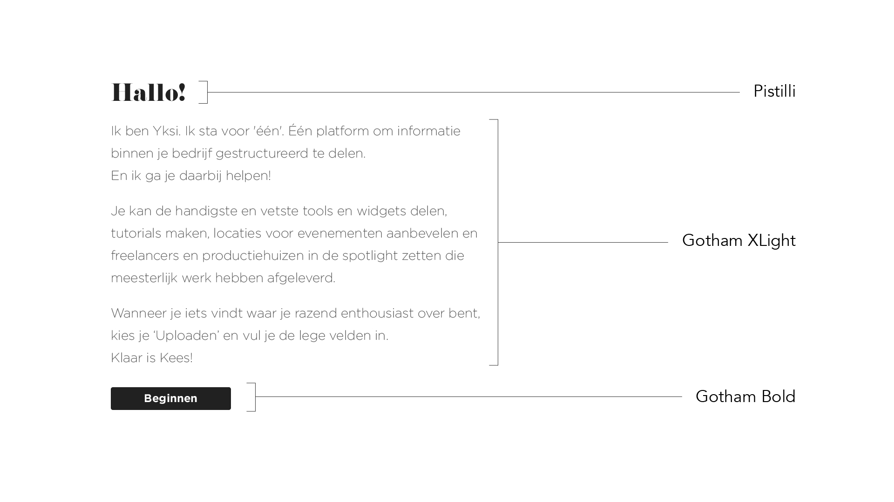

# 15. Fonts

## Inspiratie























## **Eigenschappen**

Eigenschappen waar een font aan moet voldoen, zodat het past bij de tone of voice en sfeer van mijn product.

* Speels
* Genderneutraal
* Krachtig
* Innovatief
* Simplistisch
* Vriendelijk
* Duurzaam
* Ongelimiteerd
* Ruimte

## Fonts

### Preview

### Font pairings

De kop voelt zwaar en lomp aan en heeft te strakke lijnen, waardoor het zijn speelsheid verliest. Paragraaf is mooi in balans.

Ziet er vriendelijk, uitnodigend en luchtig uit. Mist nog een eigen unieke stijl. 

De kop is eigenzinnig en speels. De paragraaf brengt het in balans door zijn lichte gewicht en is luchtig.

De kop is eigenzinnig en speels. De paragraaf brengt het in balans door zijn lichte gewicht en is luchtig. Matcht goed met de kop, want ze komen erg overeen met elkaar.

De kop oogt te vrouwelijk en te fashion. Is ook te vaak gezien. De paragraaf past er goed bij.

## Bronnen

Kolenda, N. \(z.d.\). How to Choose the Right Font \(According to Science\). Geraadpleegd op 26 april 2019, van [https://www.nickkolenda.com/font-psychology/](https://www.nickkolenda.com/font-psychology/)

