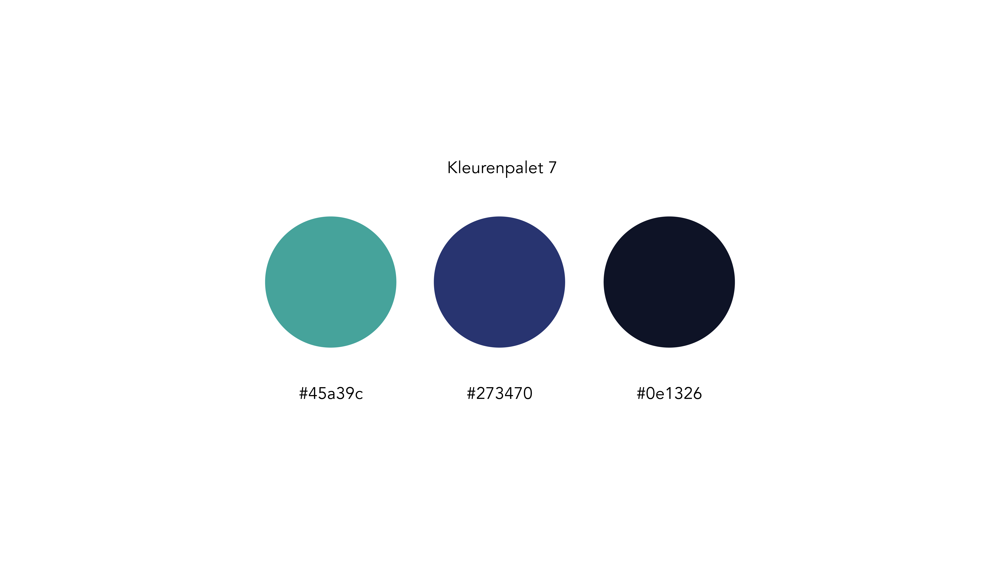

# 14. Kleuren

## 13.03.2019 - Vorige versie

## 16.03.2019 - Vorige versie

## Definitieve versie

**Oranje/geel** staat voor vrolijkheid, enthousiasme en speelsheid.  
**Paars staat** voor kwaliteit.  
**Blauw/groen** staat voor intelligentie.

## Bronnen

Kolenda, N. \(z.d.-b\). Color Psychology: An Enormous Guide. Geraadpleegd op 1 mei 2019, van [https://www.nickkolenda.com/color-psychology/](https://www.nickkolenda.com/color-psychology/)

