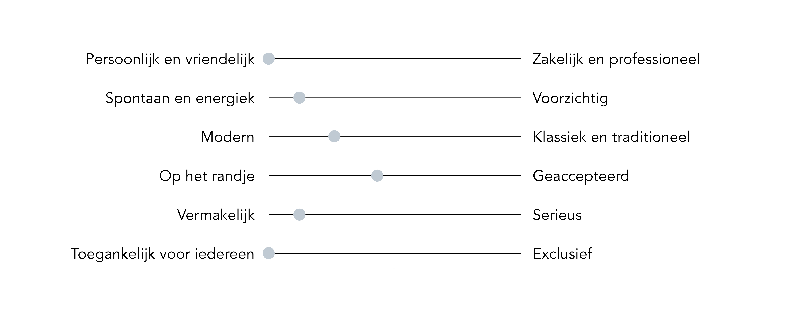

# 13. Tone of voice

## 12.03.2019 - Definitieve versie

De tone of voice is de stijl waarin een bedrijf of merk communiceert met de doelgroep. Het vormt een imago van de organisatie of product en maakt het herkenbaar. Het kan formeel of informeel zijn, serieus of losjes, persoonlijk of professioneel, modern of klassiek en toegankelijk voor iedereen of exclusief. Deze tone of voice wordt toegepast in alle uitingen, zoals op de website, reclamespotjes, brochures en e-mails.

Er zijn verschillende methodes om de merkidentiteit van je product te bepalen. Dit kan bijvoorbeeld door het noemen van een aantal eigenschappen die het product beschrijft of een auto, beroemdheid en dier benoemen als metafoor.

Mijn \(web\)applicatie moet geen machine zijn, maar de gebruiker het gevoel geven dat er een mens achter zit. Daarom wil ik mijn product een persoonlijkheid meegeven.  
De eigenschappen van het product komen overeen met de eigenschappen van de doelgroep en het bedrijf.

### Eigenschappen van mijn product

- Behulpzaam  
- Down to earth  
- Eerlijk  
- Eigenzinnig  
- Enthousiast  
- Fantasierijk  
- Gedreven  
- Humor  
- Informeel  
- Nieuwsgierig  
- Oplossingsgericht  
- Oprecht  
- Vrolijk

**Maar niet:**  
- Bemoeizuchtig  
- Bot  
- Hyper  
- Ongeremd

### Karakter van mijn product

### Persoonlijkheidstype

De eigenschappen van mijn product doen denken aan een kat. Een persoonlijkheidstype die hier op lijkt, is de Logicus\*1 \(**I**ntrovert, I**n**tuitive, **T**hinking, **P**rospecting, **A**ssertive\).\*2  
Mijn product zal niet letterlijk alle eigenschappen van de Logicus die hieronder worden benoemd overnemen, maar het geeft een gezicht achter de applicatie.

**Introvert**  
Introverte individuen geven de voorkeur aan solitaire activiteiten en raken uitgeput door sociale interactie. Ze zijn over het algemeen vrij gevoelig voor externe stimulatie \(bijvoorbeeld geluid, zicht of geur\).

**Intuitive \(Intuïtief\)**  
Intuïtieve mensen zijn erg fantasierijk, ruimdenkend en nieuwsgierig. Ze geven de voorkeur aan nieuwsgierigheid boven stabiliteit en richten zich op verborgen betekenissen en toekomstige mogelijkheden.

**Thinking \(Denkend\)**  
Denkende individuen richten zich op objectiviteit en rationaliteit, waarbij ze prioriteit geven aan de logica boven emoties. Ze hebben de neiging om hun gevoelens te verbergen en efficiëntie belangrijker te vinden dan samenwerking.

**Prospechting \(Onderzoekend\)**  
Onderzoekende individuen zijn heel goed in het improviseren en ontdekken van kansen. Ze zijn meestal flexibele, ontspannende andersdenkende mensen die liever hun opties open houden.

**Assertive \(Zelfbewust\)**  
Zelfbewuste individuen zijn zelfverzekerd, gelijkmatig en stressbestendig. Ze weigeren zich te veel zorgen te maken en leggen niet teveel druk op zichzelf als het gaat om het bereiken van doelen.

Bekende mensen met Logicus als hun persoonlijkheidstype zijn [Bill Gates](https://nl.wikipedia.org/wiki/Bill_Gates), [Ellen Page](https://nl.wikipedia.org/wiki/Ellen_Page), [Kirsten Stewart](https://nl.wikipedia.org/wiki/Kristen_Stewart), [Albert Einstein](https://nl.wikipedia.org/wiki/Albert_Einstein) en [Isaac Newton](https://nl.wikipedia.org/wiki/Isaac_Newton).

### Intro

**Intro**  
Hey! Ik ben Yksi. Ik sta voor 'één'. Één platform om informatie binnen je bedrijf gestructureerd te delen. En ik ga je daarbij helpen!

Je kan onder andere artikelen delen over de vetste technische innovaties, foto's en video's van mensen die je inspireren \(of van je kat\), strategieën om een nieuw product in de spotlight te zetten en freelancers en productiehuizen die goed bij jouw project zouden passen.

Wanneer je iets vindt waar je razend enthousiast over bent of je wil je collega's op de hoogte houden van een project, kies je een template en vul je de lege velden in. Druk op de knop en klaar is Kees!

## Bronnen

Oud, N. \(2019, 16 januari\). Tone of voice bepalen; zo vind je jouw tone of voice \| Nicooud.com. Geraadpleegd van [https://nicooud.com/tone-of-voice-bepalen](https://nicooud.com/tone-of-voice-bepalen)

Our Framework \| 16Personalities. \(2013, 18 oktober\). Geraadpleegd op 12 maart 2019, van [https://www.16personalities.com/articles/our-theory](https://www.16personalities.com/articles/our-theory)

Snel, C. \(2019, 22 februari\). Zo vind je de juiste tone of voice voor jouw merk - Frankwatching. Geraadpleegd van [https://www.frankwatching.com/archive/2017/02/27/zo-vind-je-de-juiste-tone-of-voice-voor-jouw-merk/](https://www.frankwatching.com/archive/2017/02/27/zo-vind-je-de-juiste-tone-of-voice-voor-jouw-merk/)

