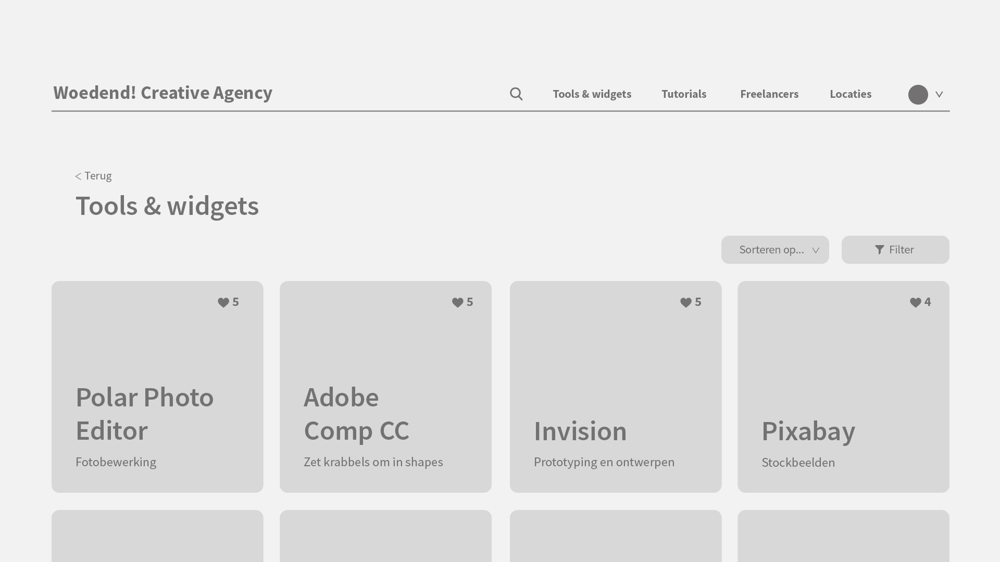
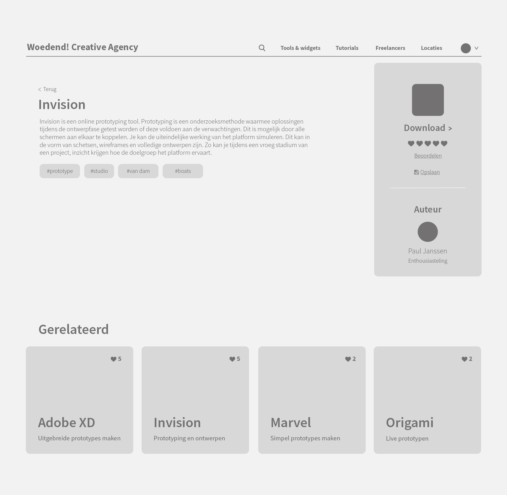
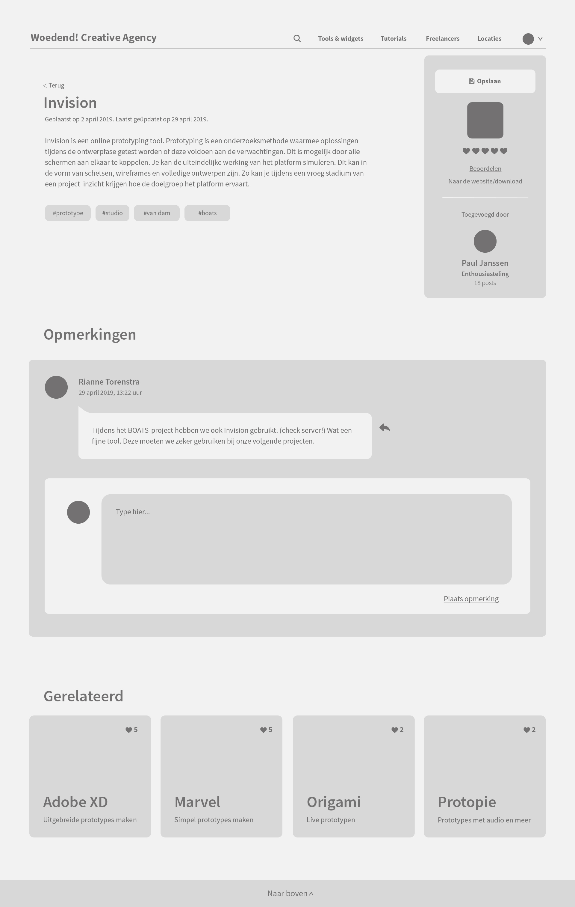

# 10. User interface \(+ tests\)

## 11.04.2019

### User interface v1

### Testplan

**Datum**  
15.04.2019

**Met wie**  
Studenten en coach van de Hogeschool van Amsterdam

**Doel**   
Vaststellen of gebruikers gedeelde informatie snel en makkelijk kunnen terugvinden in de applicatie en snappen hoe de structuur werkt.

**Intro**  
Tegenwoordig worden steeds meer derde partijen en freelancers ingezet in bedrijven. Freelancers zijn werknemers zonder een vast contract. Nederland telde vorig jaar maar liefst 1,1 miljoen freelancers. Het merendeel hiervan is werkzaam inde creatieve sector. Doordat deze flexibele werkers meestal tijdelijk bij een bedrijfwerken, gaat hun kennis verloren in het bedrijf wanneer zij vertrekken.  
Ook tussen vaste medewerkers speelt dit probleem. Informatie wordt niet overgebracht of niet op het goede moment. De informatie die tussen een medewerker en freelancer of derde partij wordt gedeeld, wordt vaak ook niet gedeeld tussen de medewerkers onderling. Er wordt langs elkaar heen gewerkt wat leidt tot dubbel werk en het verliezen van tijd.

**Vragen**  
- Wat is het doel van de applicatie?  
- Bekijk de homepagina. Begrijp je wat je onder elke categorie kan vinden? Mis je nog categorieën?  
- Wanneer je een tutorial van je collega over maskers in Photoshop wil bekijken, vind je het dan belangrijk dat je kan zien hoe vaak deze is geliket?  
- Wanneer je op zoek bent naar een handige tool om te plannen, vind je het dan belangrijk dat je kan zien welke het meest wordt geliket?  
- Zou je jouw gelikete tools, tutorials, freelancers en locaties willen terugvinden?  
- Bekijk de sorteer- en filterknop van Tools & widgets. Vind je deze filters relevant? Mis je nog bepaalde filters?  
- Bekijk de Tools & widgets-detailpagina. Denk je dat tags aan berichten meegevenhelpt om sneller en makkelijker informatie terug te vinden? Heb je nog andere ideeën over hoe dit zou kunnen?  
- Bekijk de Freelancerspagina. Vind je het beoordelingssysteem duidelijk? Zo niet, hoe zou je dit anders doen?  
- Bekijk de sorteer- en filterknop van Freelancers. Vind je deze filters relevant? Mis je nog bepaalde filters?  
- Wat zijn de plus- en minpunten van deze applicatie?  
- Zou je de applicatie zelf gebruiken?  
- Verder nog opmerkingen?

### Feedback

**Kritieken**

* Hoe like je een tool/widget?
* Tools, widgets en tutorials worden alleen geliked door personen die er belang bij hebben. Als er maar 1 programmeur in het team zit, zal de tool/widget/tutorial maar één keer geliket worden, terwijl deze wel heel goed kan zijn.
* Het is niet meteen duidelijk wat _Freelancers_ inhoudt.
* Plaats wat content in de wireframes in plaats van Lorem Ipsum.
* Maak de zoekbalk primair. Stel een vraag zoals "_Waar ben je naar op zoek?_".
* Zet meer informatie over de tool/widget/tutorial in een hover.
* Maak het filteren op datum mogelijk.
* Hoe zoekt een gebruiker wanneer hij niet weet hoe een tool of widget heet?
* Laat verschillende categorieën zien bij zoekresultaten.
* Geef tips en criteria bij het zoeken.
* Zorg dat de gebruiker niet te lang moet scrollen.
* Maak naast een like-knop ook een opslaan-knop.

**Pluspunten**

* Meest recente posts wanneer er geen sorteer/filter is ingeschakeld, is goed.

#### Andere opmerkingen

* Beredeneer je ontwerpkeuzes.
* Maak user stories.

## 24.04.2019

### Aanpassingen

* Zoekfunctie primair en uploaden secundair gemaakt.
* Zoekfunctie geeft hints weer van bestaande topics.
* Gebruikers kunnen tools & widgets en Tutorials beoordelen, in plaats van liken.
* Gebruikers kunnen op beoordeling sorteren.
* Gebruikers kunnen oplopend en aflopend sorteren.
* Gebruikers kunnen filteren op datum.
* Gebruikers kunnen filteren op beoordeling.
* Een hover over een topic geeft meer informatie weer.
* Gebruikers kunnen topics opslaan.
* Gebruikers hebben een titel gebaseerd op hoeveel ze delen.
* Echte content in plaats van Lorem Ipsum.

### User interface v2

### Testplan

**Datum**  
25.04.2019

**Met wie**  
Studenten en coach van de Hogeschool van Amsterdam

**Doel**  
Vaststellen of gebruikers gedeelde informatie snel en makkelijk kunnen terugvinden in de applicatie, gemakkelijk informatie kunnen uploaden en snappen hoe de structuur werkt.

**Vragen**  
- Vind je de zoekfunctie handig in gebruik? Kan je zoeken waar je op wil zoeken? Mis je nog iets?  
- Vind je de uploadfunctie handig in gebruik? Mis je nog iets?  
- Wat vind je ervan dat zoeken primair is en uploaden secundair?  
- Mis je nog filter- of sorteerknoppen?  
- Wat vind je ervan dat gebruikers een titel krijgen op basis van hoeveel zij delen? Motiveert dit genoeg? Heb je misschien andere ideeën hoe dit zou kunnen?

### Feedback

**Kritieken**

* Beoordelingen zijn niet heel belangrijk. Deze zou uit de sorteer- en filterknop worden gehaald.
* Zijn al die filters nodig? Heb je niet aan afdeling en type genoeg?
* De datum zou automatisch kunnen worden geüpdatet, wanneer deze nog relevant is.
* Dit kan door de mogelijkheid te geven om opmerkingen te plaatsen.
* Download URL is er niet altijd. Link bijvoorbeeld naar de website.
* Geef gebruikers meer vrijheid in het format waarin ze uploaden. Geef ze de mogelijkheid om afbeeldingen en video's te embedden \(Tools & widgets\) van bijvoorbeeld een project waarin de tool of widget is gebruikt.
* Laat de Opslaan-knop meer opvallen.
* Geef aan bij welke stap de gebruiker is tijdens het uploaden.
* URL wil je meestal als eerst invullen wanneer je uploadt.

**Pluspunten**

* Titels/badges geven aan de gebruikers op basis hoeveel ze uploaden, is een goede motivatie. Dit kan nog meer versterkt worden door te weergeven hoeveel topics ze hebben gedeeld.

#### Andere opmerkingen

* Laat een expert naar jouw product kijken. Hij kan advies geven over hoe de werknemers- en gevers van Woedend! dit product kunnen gebruiken in de eerste weken/maanden, wanneer deze nog leeg is.

## **26.04.2019**

### **Aanpassingen**

* Beoordeling uit de filterknop gehaald.
* Gebruikers kunnen opmerkingen plaatsen onder een topic. De datum wordt geüpdatet.
* De download URL is vervangen met een URL naar de website.
* Gebruikers hebben bij Tools & widgets een uitgebreidere teksteditor.
* De knop om topics op te slaan is opvallender.
* Wanneer de gebruiker een topic uploadt, wordt er aangegeven bij welke stap hij is.
* De gebruiker kan bij het uploaden de URL nu in de eerste stap invullen, in plaats van de derde stap.
* De afdeling en type moeten als eerst worden ingevuld bij het uploaden.
* Onder de naam van de gebruiker staat hoeveel topics hij heeft gedeeld.
* Freelancer-pagina aangemaakt.

### User interface v3

_Door de hoeveelheid schermen laat ik hier alleen de belangrijkste schermen zien._

### Testplan

**Datum**  
1-2 mei 2019

**Met wie**  
Gebruikers en collega’s van Woedend! Creative Agency

**Doel**  
Vaststellen of gebruikers gedeelde informatie snel en makkelijk kunnen terugvinden in de applicatie, gemakkelijk informatie kunnen uploaden en snappen hoe de structuur werkt.

**Intro**  
Je doet mee aan een usabilitytest van het platform dat kennisdelen tussen werknemers stimuleert. De schermen die je te zien krijgt zijn slechts wireframes en hebben geen opmaak. Je hoeft alleen naar de structuur en functies te kijken. Nog niet alles is klikbaar.  
Het doel van deze test is vaststellen of je het platform makkelijk kan gebruiken en alles wat je nodig hebt kan vinden. Vertel hardop wat je denkt, waarop je klikt en waarom. Dat helpt mij voor een beter testresultaat.

**Taken**  
- Je bent op zoek naar een tool die je vorig jaar voor een project hebt gebruikt. Hoe zou je dit aanpakken?  
- Je wil een freelancer die is gebruikt voor een aantal projecten toevoegen aan het platform. Hoe zou je dit aanpakken?  
- Je vindt een freelancer die je wil gebruiken voor een project in de toekomst. Sla deze op. Hoe vond je dit gaan?

**Vragen**  
- Vind je de zoekfunctie handig in gebruik? Mis je nog iets waar je op wil zoeken of zijn er dingen die overbodig zijn?  
- Vind je de uploadfunctie handig in gebruik? Heeft het een logische volgorde? Mis je nog iets of zijn er dingen die overbodig zijn?  
- Wat vind je van de manier waarop beoordelingen worden weergeven?  
- Mis je nog filter- of sorteerknoppen?  
- Wat vind je ervan dat gebruikers een titel krijgen op basis van hoeveel zij delen? Motiveert dit genoeg? Heb je misschien andere ideeën hoe dit zou kunnen?  
- Heb je nog andere opmerkingen?

### Feedback

**Testpersoon: Jimmy \(Stagiair Creatie\)**  
- Zou eerst browsen en dan direct zoeken.  
- Wanneer hij een freelancer wil toevoegen, verwacht hij een knop _Toevoegen_ op de Freelancer-pagina.  
- Opslaan verliep goed.  
- Mist het jaartal in de zoekfunctie.   
- Zou willen filteren op best beoordeelde.  
- Niet alleen de beoordeling weergeven, maar ook de maximale beoordeling. \(gevulde en lege hartjes\)  
- Vindt een titel op basis hoeveel je deelt een gaaf idee. Kan uitgebreid worden, denk aan een randje om de profielfoto of het thema van het platform.  
- Vindt het handig dat je tutorials kan plaatsen en vertellen over hoe een tool werkt, in plaats van alleen een tool geven.  
  
**Testpersoon: Paul \(Strategie\)**  
- Mist het jaartal in de zoekfunctie.  
- Wanneer hij een freelancer wil toevoegen, verwacht hij een knop _Toevoegen_ op de Freelancer-pagina.  
- Maak de _Uploaden_-knop meer prominent op de homepagina.  
- Zal de zoekmachine ook gaan zoeken op tekst uit de beschrijvingen?  
- Opslaan verliep goed.  
- Om gebruikers te motiveren, zou je ze mails of notificaties kunnen sturen wanneer zij het platform een tijdje niet hebben bezocht, met bijvoorbeeld de vraag "Heb je de afgelopen maand nog iets leuks gevonden?" of "Piet heeft na een lange tijd weer wat geüpload."  
- Vraagt zich af of een hartje voor de beoordeling wel het juiste icon is, maar na het één keer gezien te hebben weet je dat ook.  
- Denkt dat een titel op basis hoeveel je deelt binnen het bedrijf niet per se motiveert.  
- Widgets vallen ook onder Tools.  
- _Locaties_ is vaag. Maak hier _Productie_ van. Hier kunnen ook printshops etc. onder vallen.  
- Het opslaan van freelancers is erg handig. Je zou hier lijstjes van kunnen maken. Geef de mogelijkheid om dit te kunnen exporteren naar PDF.

**Testpersoon: Jolien \(Creatie\)**  
- Wanneer ze een freelancer wil toevoegen, verwacht ze een knop _Toevoegen_ op de Freelancer-pagina.  
- Afdeling Concept mist nog.  
- Maak van afdeling Grafisch en ontwerp, _Creatie.  
-_ Is het verplicht om een beschrijving te typen?  
- Mist een terug-knop bij het uploaden.  
- Verander de term _Uploaden_ naar _Toevoegen_. Uploaden is meer voor een beeldbank.  
- Vindt het goed dat je afbeeldingen van het werk van een freelancer kan toevoegen, zodat je deze in één oogopslag kan zien.  
- Wil de mogelijkheid dat je kan aangeven of er eerder is samengewerkt met een freelancer.  
- Zou _Beschrijving/Opmerkingen_ bij het uploaden van een freelancer bij de laatste stap verwachten.  
- Geef _Ondertitel_ een andere term, zoals _Omschrijf de tool in één zin_.  
- Misschien een goed idee om een wachtwoordmanager te integreren.  
- Kan de _Opslaan_-knop niet snel vinden. Weet ook niet of ze het zal gebruiken. Waarschijnlijk wel als er tientallen tot honderden tools zouden zijn.  
- Vindt een titel op basis hoeveel je deelt een leuk idee. Dit maakt het persoonlijk.  
- Houd de weergave van beoordelingen consistent.  
- _Locaties_ is vaag. Maak hier _Productie_ van. Hier kunnen ook printshops etc. onder vallen.  
- Vindt mails/notificaties een goed idee. Kunnen ook gerichte berichten zijn.  
- Verander de term _Technisch_ bij _Freelancers_ naar _Developers_.  
- Zou van _Foto en video_ twee aparte categorieën maken.  
- Voeg een categorie met productiehuizen toe. Deze vallen niet onder freelancers. Dit zijn er heel veel en dus belangrijker dan onafhankelijke freelancers.

**Testpersoon: Èwa \(Creatie\)**  
- Mist het jaartal in de zoekfunctie.  
- Het zou handig zijn als je kan zoeken op projectnummers. Soms worden er rare en onlogische namen aan projecten gegeven.  
- Zou een link naar de server willen.  
- Maak van afdeling Grafisch en ontwerp, _Creatie.  
-_ Is het verplicht om alles in te vullen bij het uploaden?  
- Mist een terug-knop bij het uploaden.  
- Bij het invullen van tags zou je hints kunnen laten zien van veel gebruikte tags.  
- Het opslaan van tools/freelancers/productie in lijsten zou handig zijn.  
- Voeg een categorie met productiehuizen toe. Dit zijn voornamelijk fotografen en videografen.  
- Misschien de prijsklasse van een freelancer weergeven. Is wel lastig, omdat goedkoop voor de een niet goedkoop is voor de ander.  
- Wil de mogelijkheid dat je kan aangeven dat een freelancer is aangesloten bij een productiehuis.  
- Vindt mails/notificaties een goed idee. Gerichte berichten kunnen beperken in wat je toevoegt.  
- Je zou een mooie illustratie van een willekeurige illustrator op de achtergrond van de homepagina kunnen neerzetten.

### Feedback opdrachtgever Rianne

- Onder productie vallen productiehuizen, diensten en locaties.  
- _Tutorials_ weghalen. Dit is niet het doel van de applicatie.  
- Wil kunnen zoeken op projectnummers. Dit linkt met de nummers op de server. Zo kan je werk van bijvoorbeeld een freelancer op de server bekijken zonder te hoeven zoeken.  
- Vooral bij kleine bedrijven speelt het probleem. Weinig kennis geborgd en expertisegroepen zijn klein.

### Feedback coach HvA

Pas de hoofdvraag eventueel aan. Op zoek gaan naar de juiste motivatie is te gedetailleerd, als je nog niet weet of het platform zelf werkt of niet. Je hebt onderzocht dat gamification waarschijnlijk niet gaat werken bij jouw platform \(licht toe\), dus maak gewoon een goed werkend product. Het is mij ook nog niet helemaal duidelijk om welke content het gaat.

### Conclusie

Ik ga me minder richten op motivatie en een goed werkend product voor de gebruiker centraal stellen. Ik denk dat een goed product de gebruiker automatisch zal motiveren. Ik ga wel alsnog tests uitvoeren over welke extra motivatie het best zou werken, zodat gebruikers het platform zullen blijven gebruiken.  
Mijn user stories moeten volledig uitgewerkt worden. Dit zijn er nog erg veel, dus moet de belangrijkste eruit halen en minder belangrijke elimineren.  
De categorie Tutorials wordt eruit gehaald. Dit valt buiten het doel van de applicatie. Dit kan eventueel nog wel worden geüpload als video in een tool-post.  
De gebruiker kan nu lijsten aanmaken en tools/freelancers/productie eraan toevoegen. Deze lijsten kunnen worden gedeeld met andere gebruikers, zodat zij ook dingen eraan kunnen toevoegen. Ze kunnen ook worden geëxporteerd, zodat er buiten de applicatie kan worden gekeken naar prijs en beschikbaarheid.

  
  
[&gt; Bekijk mijn nieuwe hoofdvraag](../#hoofdvraag-5)

## **06.05.2019**

### **Aanpassingen**

#### Algemeen

* De gebruiker kan nu lijsten aanmaken en tools/freelancers/productie eraan toevoegen. Deze lijsten kunnen worden geëxporteerd en worden gedeeld met andere gebruikers.
* De _Toevoegen_-knop is prominenter gemaakt. Wanneer de gebruiker op deze knop klikt, kan hij/zij weer terug naar de zoekfunctie als hij/zij er nog een keer op klikt.
* De categorie Tools & widgets heet nu _Tools_.
* De categorie _Grafisch & ontwerp_ heet nu _Creatie_.
* De categorie Productie bestaat nu uit _Productiehuizen_, _Diensten_ en _Locaties_.
* Bovenaan op de Tools-, Freelancers- en Productiepagina staat nu een _Toevoegen_-knop.

#### Zoekfunctie

* In de zoekfunctie kan er gezocht worden op jaartal.

#### Toevoegfunctie

* In de zoekfunctie kan er gezocht worden op projectnummer\(s\). Deze kan dus ook worden opgegeven in de toevoegfunctie.
* Gebruikers kunnen een afbeelding instellen als profielfoto voor een topic, die wordt weergeven op de homepagina en browse pagina's.
* Wanneer er tags worden meegegeven, verschijnen de meest gebruikte tags.
* Er is een terugknop geplaatst, zodat de gebruiker altijd terug kan gaan naar de vorige stap als er een fout is gemaakt.
* 
### **User interface v4**

_Door de hoeveelheid schermen laat ik hier alleen de belangrijkste schermen zien._

### Testplan

**Datum**  
24 mei 2019

**Met wie**  
Gebruikers en collega’s van Woedend! Creative Agency

**Doel**  
Vaststellen of gebruikers weten hoe ze een tool/freelancer/productie kunnen vinden en toevoegen, of zij snappen hoe je een lijst aanmaakt, bewerkt en tools/ freelancers/productie eraan toevoegt en of het visual design hieraan bijdraagt.

**Intro**  
Je doet mee aan een usabilitytest van het platform dat kennisdelen tussen werknemers stimuleert. De schermen zijn zo ver mogelijk uitgewerkt, maar nog niet alles is klikbaar. Het doel van deze test is vaststellen of je tools/freelancers/productie makkelijk kan vinden en toevoegen en hoe het visual design hier aan bijdraagt. Vertel hardop wat je denkt, waarop je klikt en waarom. Dat helpt mij voor een beter testresultaat.

**Taken**  
- Voor een nieuw project ben je op zoek naar cameramannen/vrouwen die oog hebben voor commercials. Je weet dat er vorig jaar tussen 4 februari en 1 juni een goed team van cameramensen is gebruikt voor het project van Van Dam. Je weet alleen niet wie deze heeft toegevoegd. Zoek dit op.  
- Ga op zoek naar de tool InVision. Geef een beoordeling en plaats een opmerking.   
- Voor een nieuw project genaamd Health Paw wil je InVision gaan gebruiken. Sla InVision op in een lijst.  
- Bekijk hoe de lijst van Health Paw er nu uit ziet.  
- Je wil een nieuwe lijst aanmaken voor het project Scootico. Maak deze aan.  
- Je besluit om InVision toch niet te gebruiken voor Health Paw. Verwijder deze van de lijst.  
- Je hebt de perfecte tool gevonden om chatboxes te integreren op een website. Voeg deze toe.

**Vragen**  
- Hoe is het gebruik van de zoekfunctie?  
- Hoe is het gebruik van de uploadfunctie?  
- Kon je gemakkelijk een tool beoordeling, een opmerking plaatsen en opslaan in een lijst  
- Kon je gemakkelijk een opgeslagen tool terugvinden in de lijst en deze bewerken?   
- Kon je gemakkelijk een nieuwe lijst aanmaken?  
- Wat vind je van de overall visual design? Spreekt het je aan? Zijn er dingen die niet duidelijk zijn of dingen die je mist? Wat zijn de goede punten?

### Feedback

**Testpersoon: Ewa \(Creatie\)**  
- Zoekfunctie makkelijk in gebruik.  
****- Maak Titel/Afdeling/Toegevoegd door bij _Lijsten_ duidelijker.  
- Lijsten aanmaken gaat goed.  
- Verander ''Auteur'' naar ''Toegevoegd door''. Bij auteur denk ik aan de auteur van de applicatie.  
- Opslaan, beoordelen en opmerking plaatsen gaat zonder problemen.  
- Voeg beoordeling en opmerking samen, zodat de gebruiker zijn beoordeling kan toelichten.  
- Laat bij de opmerkingen zien hoeveel hartjes iemand heeft gegeven.  
- De interface is cool, clean en speels. Niet saai. Afgeronde hoeken zien er mooi uit. De tools springen eruit. Footer kan misschien een kleurtje gebruiken, net als de rest van de pagina.  
- Laat zien dat je kan scrollen omdat er meer op de pagina staat. Met bijvoorbeeld een scroll-icon, of laat een stukje wit zien.  
- Zegt nieuwsgierig te zijn naar het eindresultaat, want behoefte is groot.

**Testpersoon: Merel \(Creatie\)**  
- Zoekfunctie makkelijk in gebruik.  
****- Sommige tools/freelancers/productie zijn lastig in te delen. Licht toe tijdens het toevoegen dat je aan een collega of de werkgever moet vragen waar het moet worden gecategoriseerd. Zoiets kan ook in de footer worden geplaatst.  
- Voeg beoordeling en opmerking samen, zodat de gebruiker zijn beoordeling kan toelichten.  
- Laat bij de opmerkingen zien hoeveel hartjes iemand heeft gegeven.  
- Laat zien dat je kan scrollen omdat er meer op de pagina staat. Met bijvoorbeeld een scroll-icon, of laat een stukje wit zien.  
- Weergeef op de homepagina bij de categorieën bolletjes, zodat je kan zien hoeveel tools/freelancers/producties daar staan.  
- Kan _Lijsten_ eerst niet vinden.  
- Voeg wat kleur toe aan de rest van de homepagina.  
- Maak de zoekmachine visueel wat kleiner.

**Testpersoon: Jimmy \(Stagiair Creatie\)**  
- Kalender of tekstveld bij het zoeken op datum.  
- Zoekfunctie makkelijk in gebruik.  
- Weergeef icoontjes van de tools/productie of foto's van de freelancers bij _Lijsten_.  
- De 3 icoontjes bij _Lijsten_ vallen een beetje buiten de boot.  
- Mist een wijzig-knop bij detailpagina als deze door de gebruiker zelf is toegevoegd.  
- Kan informatie goed vinden en vindt de zoekmachine handig.  
- Vindt de onderkant van de homepagina iets te clean.

### Conclusie en aanpassingen

Het zoeken via de zoekmachine verloopt zonder problemen. Alleen de datum-dropdowns heb ik vervangen door tekstveld. Dit is sneller. ''Auteur'' verandert naar ''Toegevoegd door", om verwarring te verkomen. De gebruiker kan nu zijn beoordeling toelichten. Het aantal hartjes dat iemand heeft gegeven, wordt vermeld naast zijn naam onder _Opmerkingen._ Tijdens de eerste stap van Toevoegen, komt er een vraagteken-icon te staan. Wanneer de gebruiker niet weet waar hij de tool/freelancer/productie moet indelen, klikt hij daarop en wordt er vermeld dat hij zijn werkgever of collega moet vragen waar hij het het best in kan delen. Zo blijft de applicatie goed georganiseerd. Onder de elementen bij de categorieën op de homepagina, worden er bolletjes weergeven, zodat de gebruiker weet hoeveel er staan. Bij Lijsten worden nu icoontjes weergeven, om tools/freelancers/productie in één oogopslag te herkennen. De Opslaan-knop wordt enkele seconden weergeven als Opgeslagen als de tool/freelancer/productie is toegevoegd in plaats van vast, omdat deze aan meerdere lijsten kan worden toegevoegd.   
Alle kopjes van de categorieën hebben nu een kleur \(paars\). De footer is in dezelfde stijl als de achtergrondafbeelding en linksbovenaan elke pagina \(m.u.v. de homepagina\) is er een decoratief elementje in de stijl van Yksi. Dit maakt de pagina minder clean. Teveel kleur of elementen vloeken met de afbeeldingen.

## **07.06.2019**

### **User interface definitieve versie**

_Door de hoeveelheid schermen laat ik hier alleen de belangrijkste schermen zien._

### Product quality review

Op 7 juni 2019 heb ik met UX en UI-expert Éwa van Woedend!, een product quality review uitgevoerd, om de kwaliteit en waarde van Yksi te beoordelen. Ik heb vragen gesteld als "_Denk je dat kennis op deze manier vastgelegd wordt en blijft?_", "_Zouden collega's dit gebruiken om kennis op te slaan en op te zoeken?_", "_Maakt het enthousiast?_", "_Zou je het zelf gebruiken?_" en "_Zijn er nog verbeterpunten?_". Hierover zei ze het volgende:

"Yksi ziet er clean en minimalistisch uit, daar houden we van. De afgeronde hoeken en kleuren maken het speels. Hier word ik al meteen enthousiast van.   
De applicatie maakt informatie georganiseerd en overzichtelijk. De functies zijn makkelijk in gebruik. Zelf zou ik het zeker gebruiken. Als je wil dat iedereen de applicatie gebruikt en blijft gebruiken, moet het een onderdeel in onze werkwijze worden of dat de gebruikers af en toe een herinneringsmail krijgen, zoals je zelf al had voorgesteld. De afdeling Account kan zeker die motivatie gebruiken. Creatie en Strategie zouden het sowieso wel gebruiken. Maar als veel medewerkers het gebruiken, moeten de anderen het ook wel gebruiken, zodat ze geen dingen missen en ook mee kunnen denken. \(Lijsten\)   
In de loop der tijd zullen er meer en meer tools, freelancers en productie op de applicatie komen. Dit kan er misschien voor zorgen dat sommige dingen toch niet helemaal goed werken. Maar dat kan je alleen weten door het daadwerkelijk te gaan gebruiken in de praktijk. En dan kan je die kinderziektes eruithalen.  
Voor een volgende versie zou ik aanraden om meer leuke animaties erin te verwerken, zoals springende elementjes na het inladen van de pagina, als feedback voor de gebruiker. Hovers op bepaalde knoppen zouden ook een goede toevoeging zijn."

  

