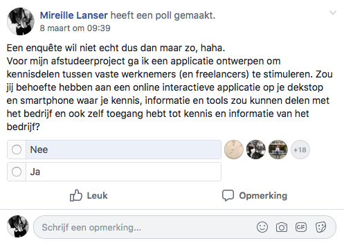

# 2. Enquête freelancers

## Enquête

Tegenwoordig worden steeds meer derde partijen en freelancers ingezet in bedrijven. Nederland telde vorig jaar maar liefst 1,1 miljoen freelancers. Het merendeel hiervan is werkzaam in de creatieve sector. Doordat deze flexibele werkers meestal tijdelijk bij een bedrijf werken, gaat hun kennis verloren in het bedrijf wanneer zij vertrekken. De informatie wordt niet \(goed\) overgebracht of niet op het goede moment. Ook wordt de informatie die wordt gedeeld tussen een medewerker en freelancer, vaak niet gedeeld tussen de medewerkers onderling. Er wordt langs elkaar heen gewerkt, dat leidt tot dubbel werk en het verliezen van tijd.

De komende weken ga ik een online interactieve desktop en mobiele applicatie ontwikkelen, waar deze kennis, informatie en handige trucjes, widgets of tools kunnen worden gedeeld. Door het invullen van deze enquête help je mij om kennisdelen tussen freelancers en bedrijven zo efficiënt mogelijk te maken.

Je blijft geheel anoniem.

### Wat voor werk doe je?

### Heb je ooit wel eens je kennis, handige trucjes, widgets of tools gedeeld met een bedrijf waar je werkzaam bent/was?

Waarom wel/niet?

**Ja**  
Wat deel\(de\) je dan zoal?

* Artikelen
* Afbeeldingen
* Video's/tutorials
* Tools
* Widgets
* Codes
* Zelf ontdekte trucjes
* Strategieën
* Andere freelancers
* Andere bedrijven
* Ervaringen met andere freelancers en bedrijven
* Anders...

Hoe deel\(de\) je dit?

* Mondeling
* E-mail
* WhatsApp/Messenger/SMS
* Website of applicatie
* Blog
* Anders...

Wanneer deel\(de\) je dit?

* Tijdens elke wekelijkse vergadering
* Tijdens de lunch
* Voor of na werktijd
* Aan het begin van een project
* Wanneer een project is afgerond
* Ik plan hier tijd voor in
* Wanneer ik het vind
* Wanneer het relevant is
* Anders...

**Nee**  
Zou je daarvoor open staan en waarom wel/niet?

### Heb je ooit wel eens kennis, handige trucjes of tools verkregen van het bedrijf waar je werkzaam bent/was?

**Ja**

**Nee**

### Zou je behoefte hebben aan een online interactieve applicatie op je dekstop en smartphone waar je kennis, informatie en tools zou kunnen delen met het bedrijf en ook zelf toegang hebt tot kennis en informatie van het bedrijf?

Waarom wel/niet?

**Ja**  
Wat zou je willen delen?

* Artikelen
* Afbeeldingen
* Video's/tutorials
* Tools
* Codes
* Zelf ontdekte trucjes
* Strategieën
* Andere freelancers
* Andere bedrijven
* Ervaringen met andere freelancers en bedrijven
* Anders...

Wanneer zou je dit delen?

* Tijdens elke wekelijkse vergadering
* Tijdens de lunch
* Voor of na werktijd
* Aan het begin van een project
* Wanneer een project is afgerond
* Ik plan hier tijd voor in
* Wanneer ik het vind
* Wanneer het relevant is
* Anders...

Zou iedereen in het bedrijf toegang mogen hebben tot jouw kennis en informatie?

**Ja**

**Nee**

Zouden andere freelancers in het bedrijf toegang mogen hebben tot jouw kennis en informatie?

**Ja**

**Nee**

## Resultaten en conclusie

Echter kreeg ik maar 6 ingevulde enquêtes terug. Waarschijnlijk hebben de freelancers er bij voorbaat al geen behoefte aan en vulden daarom de enquête niet in. 

Vervolgens heb ik een poll in dezelfde Facebookgroep geplaatst met de vraag of ze behoefte zouden hebben aan een online interactieve applicatie op je dekstop en smartphone waar je kennis, informatie en tools zou kunnen delen met het bedrijf en ook zelf toegang hebt tot kennis en informatie van het bedrijf. Ze konden kiezen tussen 'ja' of 'nee'. 100% \(21\) freelancers hebben 'nee' gestemd. 

Freelancers zeggen dus totaal geen behoefte te hebben aan zo'n applicatie. Derde partijen zullen daar dan al helemaal geen behoefte aan hebben. Misschien dat freelancers die lang werkzaam zijn bij een bedrijf wel oor hebben naar zo'n app. Dat ga ik onderzoeken.

## Vaste freelancers

Bij Woedend! Creative Agency werkt één vaste freelancer. In week 14 heb ik hem gevraagd of hij behoefte heeft om toegang te hebben tot het platform. Zijn antwoord was nee. Het verandert niets aan de functionaliteiten van het platform, maar het zal dus alleen worden gebruikt door vaste medewerkers van het bedrijf. De mogelijkheid om nieuwe gebruikers toe te voegen is er altijd, maar er kan dan niet bepaalde informatie voor hen worden afgeschermd.

