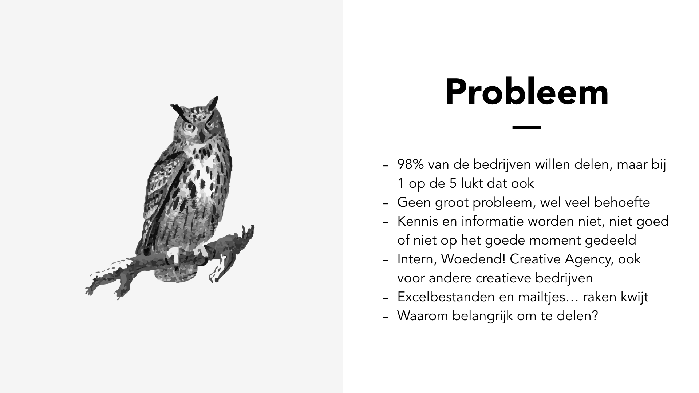

# 6. Feedback Frenzy 18 maart

Op 18 maart heb ik voor mijn afstudeergroep, begeleider en een andere groep en begeleider mijn project gepresenteerd en daarbij vragen gesteld. Ik wilde van de anderen weten wat zij dachten over de tone of voice van mijn product en de visuele stijl die ik voor ogen had.

## Presentatie

## Feedback en conclusie

Er was nog geen concreet concept en geen usability en daarom was het onmogelijk om een mening te geven over de visuele stijl. Ik heb de verkeerde keuze gemaakt om eerst de identity te bepalen van mijn product, terwijl ik nog niet weet wat het product gaat doen. Ik zal me meer moeten gaan houden aan het gezegde "_Form follows function_".

De geformuleerde tone of voice sprak het publiek wel aan. Ik zal verschillende tone of voices moeten testen op mijn gebruikers.

