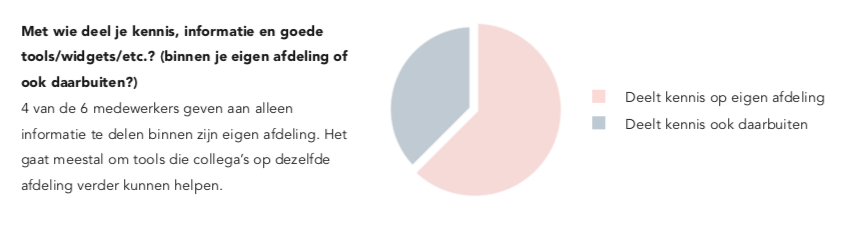
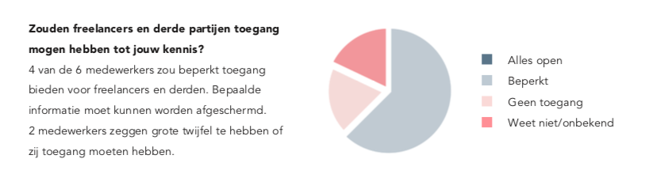

# 1. Interview medewerkers

## Plan

### **Challenge**

Wat is de huidige situatie op het gebied van kennisdeling en wat zijn de behoeften van de gebruiker \(medewerkers van Woedend! Creative Agency\)?

### **Aanname**

- De medewerkers willen informatie niet delen aan freelancers en derden, omdat zij onderscheidend willen blijven, niet weten wanneer info nuttig en relevant is en omdat ze niet gemotiveerd worden om het te delen.  
- De medewerkers zijn wel bereid om informatie te delen aan iedereen binnen het bedrijf.  
- Ervaringen met freelancers en derde partijen worden vastgelegd.

### **Scenario**

Ik ga zoveel mogelijk medewerkers binnen het bedrijf interviewen, minimaal één op elke afdeling. Ik licht de context toe van het onderzoek en ik stel hen open en gesloten vragen. 

### **Sensoren**

Elk interview wordt opgenomen, mits de geïnterviewde bezwaar maakt. Ondertussen maak ik ook aantekeningen van de belangrijkste bevindingen.

## Interviews

### Interview 1

Naam: Meghan  
Afdeling: Account  
Werkzaam op afdeling: 2 jaar  
Datum: 19 februari 2019

**Heb je wel eens je kennis, handige weetjes/trucjes of goede tools/widgets/etc. gedeeld met collega’s? Waarom wel/niet?**  
Ja, het is handig voor mezelf, maar andere collega’s hebben er ook iets aan.

**Wat heb je zoal gedeeld?**  
Evernote, dat vind ik een handige tool om lijstjes mee te maken en in samen te werken.

**Hoe heb je dit gedeeld?**  
Door een mailtje te sturen en face-to-face te vertellen.

**Met wie heb je dit gedeeld? \(binnen je eigen afdeling of ook daarbuiten?\)**  
Met de afdeling creatie.

**Op welk moment en waar heb je dit gedeeld?**  
In de beginfase van een project waar mijn collega’s en ik samen op werkten.

**Hoe ervaar je het delen van deze informatie?**  
Iedereen heeft zijn eigen manier van werken. De een werkt met Google Docs, de ander stuurt mails. Eigenlijk zou iedereen informatie gestructureerd in één tool moeten delen.

**Heb je een idee hoe je het beste informatie kan delen met elkaar?**  
Dat is lastig. Het is natuurlijk veelomvattend. Je zou een systeem moeten hebben met voor elke afdeling een eigen plek, waar je dingen kan delen of in kan werken wat gelijk wordt opgeslagen op de cloud. Het moet ook inzichtelijk zijn, zodat bijvoorbeeld ik ook bij Creatie erin kan, zodat ik op de hoogte blijf.

**Dus je zou wel behoefte hebben aan een platform waar kennis, informatie en goede tools/widgets/etc. kunnen worden gedeeld?**  
Jazeker. Soms wordt mijn naam niet in de CC gezet in een mail, waardoor ik niet op de hoogte ben van afspraken tussen Account en Creatie. Hierdoor belanden we vaak in onduidelijke situaties.

**Geldt dat ook voor afspraken met freelancers en derden?**  
Ja, dat zou ook kunnen. Ik weet alleen niet of je hen in zo’n tool moet betrekken. Ik kan me wel voorstellen dat je afspraken met freelancers en derden in zo’n tool zet. Aan de andere kant, het is misschien juist handig, als een freelancer of derde partij langer aan een project werkt, hij wel erbij kan.

**Zouden al je collega’s toegang mogen hebben tot jouw kennis?**  
Ja. Ik twijfel of het handig is als Creatie inzicht heeft in definanciën. Creatie moet keuzes maken met als motivatieeen creatief uitgangspunt. Wanneer ze inzicht zoudenhebben op de financiën, zouden ze misschien niet altijdbeslissingen maken uit creatief uitgangspunt.

**Sta je zelf in contact met freelancers en derde partijen?**  
Ja, ik ben meestal de eerste contactpersoon.

**Hoe ervaar je de samenwerking met hun?**  
Prettig. Dat verschilt wel per partij.

**Wat vind je belangrijk in een samenwerking met hen?**  
Dat afspraken worden nagekomen en duidelijke communicatie.

**Leg je de ervaringen vast van de samenwerkingen met hen?**  
Nee, eigenlijk niet.

**Zou je hier behoefte aan hebben?**  
Ja, dat zou zeker bruikbaar zijn. We zijn nu een klein bedrijf en je kan mond op mond overdragen hoe de ervaring was. Maar in een soort archief zou je beter kunnen bepalen welke freelancer je voor welk project inzet en wat de aandachtspunten voor als we gaan samenwerken met die freelancer of derde partij. Nu blijft die informatie bij jezelf en het wordt niet vastgelegd.

**Delen freelancers en derden hun kennis, informatie en goede tools met jou?**  
Dat gebeurt wel eens.

**Hoe leggen zij dit vast? Ook via de mail?**  
Vaak wel. Laatst met een derde partij bijvoorbeeld, moesten we een deel van een website hebben en zij meldden dat ze deze en deze link hadden gebruikt.

**Gebeurde dat ook mondeling?**  
Ja, maar dus niet in een bepaald systeem. Ze zouden zichzelf in de voet kunnen schieten hiermee, als zij al hun waardevolle kennis en informatie zouden delen. Dan zouden wij dat sneller oppakken en hen minder snel inschakelen. Een freelancer of derde partij waar je een goede band mee hebt, willen je nog wel eens helpen.

**Zou je behoefte hebben aan een platform waar deze kennis, informatie en goede tools van freelancers en derden worden gedeeld aan jou en je collega’s?**  
Ja, dat zou erg handig zijn. Aan de ene kant kunnen zij zichzelf in de voet schieten, maar aan de andere kant werken wij liever met partijen waar we relaxt mee kunnen samenwerken. Als ze slim zijn, doen ze het wel, maar tot een bepaalde hoogte.

**Zouden freelancers en derden ook toegang tot elkaars kennis en informatie mogen hebben?**  
Dat zou in principe wel sterk zijn.

### Interview 2

Naam: Merel  
Afdeling: Creatie  
Werkzaam op afdeling: 3,5 jaar  
Datum: 19 februari 2019

**Heb je wel eens je kennis, handige weetjes/trucjes  
of goede tools/widgets/etc. gedeeld met collega’s? Waarom wel/niet?**  
Ja, doe ik bijna de hele tijd, omdat ik weet dat wij als groep daar baat bij hebben. Daar worden wij beter door.

**Wat heb je zoal gedeeld?**  
Gister zag ik bij Sketch dat je werkende prototypes kan maken. Daar zag ik tutorials van en dat zag er cool uit. Dit heb ik gelijk met Éwa \(afd. Creatie\) gedeeld.

**Hoe heb je dit gedeeld?**  
Vaak deel ik dat gewoon mondeling. Dat blijft langer hangen. Mailtjes worden niet gelezen of ze komen niet aan.

**Met wie heb je dit gedeeld? \(binnen je eigen afdeling of ook daarbuiten?\)**  
Eigen afdeling. Hangt wel af van wat voor informatie het is. Iets op designgebied zou ik niet zo snel met Meghan \(afd. Account\) delen.

**Op welk moment en waar heb je dit gedeeld?**  
Ik heb eerst de tutorial zelf bekeken, of het wel het delen waard was. Daarna gelijk gedeeld.

**Hoe ervaar je het delen van deze informatie?**  
Misschien is het handiger om het ergens vast te leggen, zodat we het makkelijker terug kunnen vinden. Er is zoveel informatie te vinden op het internet. Dat onthou je niet allemaal.

**Zou je behoefte hebben aan een platform waar kennis, informatie en goede tools/widgets/etc. kunnen wordengedeeld binnen het bedrijf?**  
Ja, denk het wel. Ik hou wel van structuur. Ik zou het niet erg vinden!

**Zouden al je collega’s toegang mogen hebben tot jouw kennis?**  
Ja, waarom zou je dat niet willen?

**Zouden freelancers en derde partijen toegang mogenhebben tot jouw kennis?**  
Dat vind ik een lastige. Je hebt allemaal een functie binnen het bedrijf met elk een eigen specialiteit en als je dat gaat delen met een ander bedrijf... wordt dat misschien een beetje lastig. Dan geef je eigenlijk je kennis weg. Je werkt er niet voor altijd mee samen. Freelancers zouden misschien wel toegang mogen hebben. Die komen lang  
in het bedrijf werken en daar heb je een goede band mee opgebouwd en dan wil je dingen delen. Dat heb je minder snel met mensen die hier één keer over de vloer komen.

**Sta je in contact met freelancers en derde partijen?**  
Nee, dat is niet mijn taak.

**Zou je behoefte hebben aan een platform waar de kennis, informatie en goeede tools van freelancers en derden worden gedeeld aan jou en je collega’s?**  
Dat zou een beetje hypocriet zijn, als ik het zelf niet zou delen en wel van hen zou vragen. Het zou natuurlijk wel handig zijn, maar zal het niet verwachten.

### Interview 3

Naam: Éwa  
Afdeling: Creatie  
Werkzaam op afdeling: 3,5 jaar  
Datum: 20 februari 2019

**Heb je wel eens je kennis, handige weetjes/trucjes  
of goede tools/widgets/etc. gedeeld met collega’s? Waarom wel/niet?**  
Ja. Voornamelijk met stagiair\(e\)s, omdat ik denk dat zij sommige apps en tools nog niet kennen. Daar kan ik iets aan leren. Merel \(afd. Creatie\) en ik liggen vaak op dezelfde lijn. Wij zitten naast elkaar en als we dan iets vinden dan kunnen we dat snel delen. Mondeling, maar ook via mail. Als zij in een andere ruimte had gezeten, hadden we niet zo snel dingen gedeeld. Jolien \(afd. Creatie\) en ik vormen samen een team. Het meeste wat zij weet, weet ik ook.

**Wat heb je zoal gedeeld?**  
Mockups van websites en t-shirts bijvoorbeeld. Stockwebsites. Dat gebruiken we heel vaak, net als de tool Muzli. Dat is een verzamelplatform/blog dat we hebben ingesteld als startpagina van onze browser. Hier word je erg door geïnspireerd.

**Met wie heb je dit gedeeld? \(binnen je eigen afdeling of ook daarbuiten?\)**  
Met afdeling Creatie dus wel, maar met Meghan en Rianne \(afd. Account\) niet. Daar zie ik het nut niet van in. Tools die ik deel helpen meestal alleen Creatie verder.

**Op welk moment en waar heb je dit gedeeld?**  
Ik deel het wanneer ik het vind of wanneer het relevant is. Als we voor een klant stockvideo’s moeten vinden, dan is dat het moment waar ik dat deel.

**Leg je dit op een of andere manier vast?**  
Het zit in mijn hoofd en heb digitale sticky notes op mijn desktop. Daar sla ik dingen op wat in de toekomst van pas zou kunnen komen.

**Hoe ervaar je het delen van deze informatie?**  
Ik vind deze manier heel handig.

**Zou je behoefte hebben aan een platform waar deze kennis, informatie en goede tools kunnen wordengedeeld binnen het bedrijf?**  
Ja, vooral voor freelancers zou dat handig zijn. Die nemen hun kennis mee als zij de deur uit lopen. Ik weet niet of zij bereid zijn om hun kennis te delen. Als werknemer wil  
je dat het hele bedrijf er beter van wordt. Zo’n platform moet wel worden bijgehouden. In het begin zal iedereen enthousiast zijn en na een half jaar denken ze “Oh ja, we hadden nog dat ene platform...”. Je hebt ook vertrouwen in elkaar nodig. Jolien \(afd. Creatie\) en ik delen samen een Google Docs-documentje en het zou niet fijn zijn als vier freelancers er dingen in zetten die niet van ons niveau zijn.Dan zouden er duidelijke categorieën moeten komen, omeen rommeltje te voorkomen.  
Ervaringen met bijvoorbeeld fotografen zouden ook aangegeven kunnen worden, met een rating. In het verleden heb ik samengewerkt met een illustrator, met  
een goed portfolio, maar de samenwerking verliep niet  
zo goed. Als een nieuw iemand hier zou komen werken, weet hij niet dat de samenwerking met die illustrator stroef verliep.

**Zouden freelancers en derde partijen toegang mogenhebben tot jouw kennis?**  
Dat zou ik in de praktijk moeten ondervinden. Nu denk ikdat ik het niet fijn zou vinden, maar ik sta er wel voor open.Ik zou bepaalde informatie afschermen voor hen. Mochten we echte pareltjes van tools hebben gevonden, zou dat ook afgeschermd moeten worden.  
Aan de andere kant denk ik; een freelancer zet zich in voor ons en zou dan toegang moeten hebben tot zo’n platform, al werkt hij maar een maand op een project. Concurrenten niet, hoewel ik wel informatie deel met mijn vrienden die in dezelfde branche werken.

**Sta je zelf in contact met freelancers en derde partijen?**  
Dat is meer voor de afdeling Account. Soms komt het voor dat je een taak overneemt.

**Zou je behoefte hebben aan een platform waar de kennis, informatie en goede tools van freelancers en derden worden gedeeld aan jou en je collega’s?**  
Ja, ze halen informatie uit ons platform, dus zouden ook informatie moeten delen met ons.

**Zouden alle medewerkers hier toegang tot mogen hebben?**  
Ja.

**Zouden zij ook toegang tot elkaars kennis en informatiemogen hebben?**  
Ik heb er zelf geen problemen mee. Een aantal van onze partners zijn concurrenten van elkaar. Die zouden dan geen toegang tot elkaars informatie moeten hebben. Dat is dus aan henzelf.

### Interview 4

Naam: Jolien  
Afdeling: Creatie  
Werkzaam op afdeling: 3,5 jaar  
Datum: 20 februari 2019

**Heb je wel eens je kennis, handige weetjes/trucjes  
of goede tools/widgets/etc. gedeeld met collega’s? Waarom wel/niet?**  
Ja, heel vaak. Ik denk dat mijn collega’s daar ook iets aan hebben.

**Wat heb je zoal gedeeld?**  
Concrete voorbeelden weet ik even niet. Als ik iets cools tegenkom, deel ik het.

**Leg je dit op een of andere manier vast?**  
Nee.

**Hoe deel je het op dit moment?**  
Via de mail. We hebben een Facebookgroep, maar die wordt bijna niet meer gebruikt. Nu is het vooral op Whatsapp.

**Met wie deel je het? \(binnen je eigen afdeling of ook daarbuiten?\)**  
Meestal alleen met Creatie. Of als het om een bepaald project gaat, aan de mensen die daar aan meedoen.

**Op welk moment of waar deel je het?**  
Niet op een concreet moment.

**Hoe ervaar je deze manier van delen van informatie?**  
Doeltreffend. Het is wel lastig om iets terug te vinden.

**Zou je behoefte hebben aan een platform waar deze kennis, informatie en goede tools kunnen wordengedeeld binnen het bedrijf?**  
Ik denk dat dat wel heel handig is. Vooral lijstjes met illustrators, animators etc. die je tegenkomt, zodat je bij een project makkelijk kunt scannen wie je kan gebruiken. Deze lijst moet door iedereen aangevuld kunnen worden.

**Zouden freelancers en derde partijen toegang mogen hebben tot jouw kennis?**  
Dat zou ik niet doen. Het is handig als je notes kan maken bij illustratoren. Het is een database die je intern wil houden.

**Sta je in contact met freelancers en derde partijen?**  
Af en toe mailcontact, maar dat doet meestal de afdeling Account.

**Zou je behoefte hebben aan een platform waar de kennis, informatie en goede tools van freelancers en derden worden gedeeld aan jou en je collega’s?**  
Het zou handig zijn als bijvoorbeeld Éwa \(afd. Creatie\) samenwerkt met een freelancer en van die freelancer een handige tool leert kennen, dat zij zelf deze informatie deelt op dat platform.

**En wat als een freelancer of derde partij lang aan eenproject met jullie werkt of een goede band met jullie heeft?**  
Dat ligt eraan welke informatie erop komt en wat met de informatie gebeurt. Als er bijvoorbeeld lijstjes op zouden komen met ervaringen met freelancers, wat heeft een freelancer of derde partij hier aan, wanneer hij dat ziet?

### Interview 5

Naam: Lennart  
Afdeling: Creatie  
Werkzaam op afdeling: 12 jaar  
Datum: 20 februari 2019

**Heb je wel eens je kennis, handige weetjes/trucjes  
of goede tools/widgets/etc. gedeeld met collega’s? Waarom wel/niet?**  
Ja, om processen te versnellen en het leven van anderen wat makkelijker te maken. Als ik enthousiast ben over iets, deel ik het ook graag. Ik stuitte ooit op een uitgesproken portretfotografe, Jill Greenberg, met een speciale manier van beeldbewerken en uit enthousiasme had ik het gedeeld. Ik vind het leuk als anderen net als ik een wow- momentje krijgen. Ik zou zeker wel meer kunnen delen. Het gebeurt altijd als ik naast iemand zit, zodat ik het gelijk in de praktijk kan laten zien. Ik plan geen presentatie hiervoor in.

**Leg je dit op een of andere manier vast?**  
Nee.

**Met wie deel je dit? \(binnen je eigen afdeling of ook daarbuiten?\)**  
Hangt ervan af. Programma’s zoals Keynote gebruikt iedereen. Zoiets zou ik ook met Paul \(afd. Strategie\) delen. Het zijn vooral functionele dingen; het toepassen van trucjes. Als ik ergens extern ben bij bijvoorbeeld een beeldbewerker, dan neem ik die kennis mee, maar als ik zelf dingen anders zou doen, deel ik dat ook. Het is altijd interessant om met andere creatieven of makers kennis uit te wisselen.

**Is dat alleen met freelancers en derden waarmee je een goede band hebt?**  
Nee, ik hoef iemand niet goed te kennen.

**Zou je behoefte hebben aan een platform waar deze kennis, informatie en goede tools kunnen wordengedeeld binnen het bedrijf?**  
Ja. Ik zou het heel fijn vinden als er naslagwerk te vinden is, verdeeld in hoofdstukken, zodat het toegankelijk is. Zelf ben ik geen gestructureerde werker, dus het ligt aan  
je werkwijze. Mensen die behoefte hebben aan structuur,zouden het zeker fijn vinden. Het idee dat er zo’n platform zou zijn, is fijn, maar zou het zelf minder gebruiken. Ik sta erwel zeker voor open.

**Hoe ervaar je het delen van informatie op dit moment?**  
Dingen blijven beter hangen, wanneer je het één op één zou bespreken, naast elkaar. Ik sla het beter op, wanneer het direct wordt gedemonstreerd. Als het ergens in een document of tutorial zou staan, is het handig om het erbij te pakken als je het vergeten bent, maar ik zou het in eerste instantie niet zo op me nemen. Aan de andere kant, als wij informatie delen, dan is dat tussen ons en het kan zijn dat anderen daar ook iets aan hebben. Ik zie wel toegevoegde waarde aan zo’n platform, waar iedereen toegang tot heeft. Daar wordt iedereen beter van.

**Zouden freelancers en derde partijen toegang mogenhebben tot jouw kennis?**  
Ik denk dat het delen veel oplevert. Het ligt wel aan de applicatie en hoe informatie wordt aangeboden. Ik denk dat bepaalde informatie moet worden afschermd. Algemene informatie mag toegankelijk zijn voor iedereen.

**Sta je in contact met freelancers en derde partijen?**  
Ja.

**Hoe ervaar je de samenwerking met hen?**  
Goed.

**Wat vind je belangrijk in een samenwerking?**  
Mijn samenwerking bevindt zich meestal op het conceptuele vlak en dan is een goede klik en connectie belangrijk. Dus je moet een soort vertrouwensband hebben, zodat je je vrijer en gemakkelijker voelt.

**Leg je de ervaringen vast van de samenwerkingen met hen?**  
Nee. Freelancers hebben elk hun eigen kwaliteiten en eigenschappen en daar kies ik ze op uit. Die kennis zit in mijn hoofd. Rianne \(afd. Account\) en Paul \(afd. Strategie\) kennen dit ook wel. Maar de ervaring die je hebt met iemand is voor iedereen anders.

**Zou je hier behoefte aan hebben?**  
Als er een lijst zou zijn met freelancers en hun eigenschappen, kan ik er een uitkiezen met de eigenschappen die ik op dat moment nodig heb. Die mogelijkheid heb ik niet, als dit nergens is opgeslagen of als we het er verder niet over hebben. Door dit zichtbaar te maken, kan je sneller denken en werken.

**Zouden freelancers en derden toegang mogen hebben tot deze informatie?**  
Ligt eraan hoe gevoelig de informatie is. Als er wordt vermeld dat hij bijvoorbeeld teveel uren heeft berekend, is dat niet de informatie die je met iedereen wil delen. Puur werkgerelateerde zaken zou ik wel met iedereen delen.

**Zou je behoefte hebben aan een platform waar de kennis, informatie en goede tools van freelancers en derden worden gedeeld aan jou en je collega’s?**  
Dat kan interessant zijn, maar wel lastig.

**Zouden zij ook toegang tot elkaars kennis en informatiemogen hebben?**  
Ja en nee. Iedereen zou mogen delen en toegang hebben, als het een initiatief zou zijn waar Woedend! al haar informatie en tools etaleert en freelancers en derden dat ook willen doet. Maar de vraag blijft wat voor informatie erop komt en waar de focus op ligt. Het moet wel overzichtelijk blijven.

### Interview 6

Naam: Paul  
Afdeling: Strategie  
Werkzaam op afdeling: 15 jaar  
Datum: 20 februari 2019

**Heb je wel eens je kennis, handige weetjes/trucjes of goede tools/widgets/etc. gedeeld met collega’s? Waarom wel/niet?**  
Ja, ter inspiratie en het is leuk om te delen.

**Wat heb je zoal gedeeld?**  
Nieuwe technieken, innovaties en strategieën. Ik deel ook graag wow-dingen.

**Hoe deel je dit?**  
We hebben een Facebookgroep, maar die is niet zo actief meer. We gebruikten ook wel eens Woekie, een besloten blog.

**Op welk moment en waar deel je dit?**  
Wanneer ik iets tegenkom. Soms zit ik wel eens in de trein en dan kom ik iets interessants tegen, wat ik dan wil delen. Voor mezelf gebruik ik Braintoss, waarmee je met één  
druk op de knop iets kan vastleggen, met spraak of eenbericht. Ik plan geen specifieke momenten in om kennis eninformatie te delen.

**Zou je behoefte hebben aan een platform waar kennis, informatie en goede tools kunnen worden gedeeldbinnen het bedrijf?**  
Ja, een open platform zal helpen.

**Zouden al je collega’s toegang mogen hebben tot jouw kennis?**  
Ja. Het zou leuk zijn om de toegang wat breder te trekken, bijvoorbeeld dat freelancers en derden ook toegang krijgen. Misschien zelfs wel klanten.

**Sta je in contact met freelancers en derde partijen?**  
Ik woon wel eens evenementen bij om te netwerken. Het is meestal vluchtig contact.

**Wat vind je belangrijk in een samenwerking met hen?**  
Het moet een goeie match zijn. We moeten een klik hebben. Ze moeten ervaring hebben, snel kunnen schakelen en open minded zijn.

**Leg je de ervaringen vast van de samenwerkingen met hen?**  
Het zit in mijn hoofd, maar leg het niet vast nee. Ik heb voor mezelf wel een excelsheet met freelancers die ik leuk vind. Dit deel ik niet en waarom weet ik eigenlijk niet.

**Zou je hier behoefte aan hebben?**  
Ja. Ik stel me een platform voor met verschillende genres en tabjes, eigenschappen en competenties, waar je de freelancers en derden op kan indelen.

**Zou je behoefte hebben aan een platform waar de kennis, informatie en goede tools van freelancers en derden worden gedeeld aan jou en je collega’s?**  
Ja.

**Zouden alle medewerkers hier toegang tot mogen hebben?**  
Iedereen binnen Woedend! zou hier toegang tot mogen hebben.

**Zouden freelancers en derden hier toegang tot mogen hebben?**  
Dat weet ik niet. Ik denk dat ze dat niet willen. Ze zouden wel op Freeforce hun kennis willen delen. Dat zijn overdrachtavonden waar freelancers heen kunnen voor informatie.

## Resultaten en conclusie

